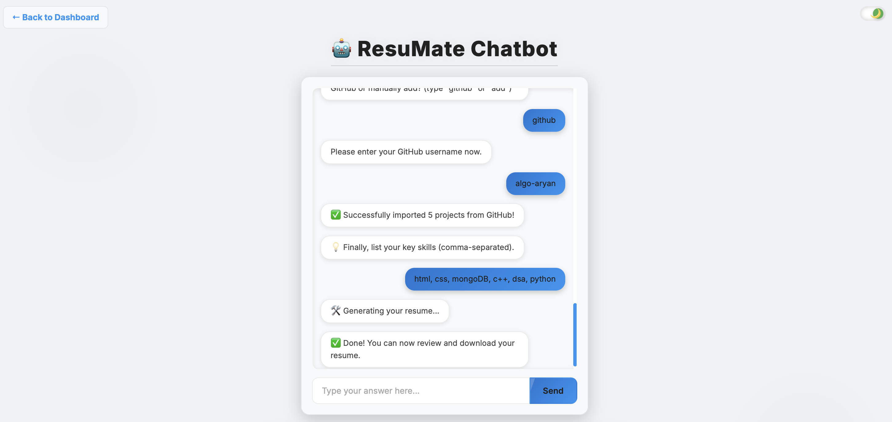
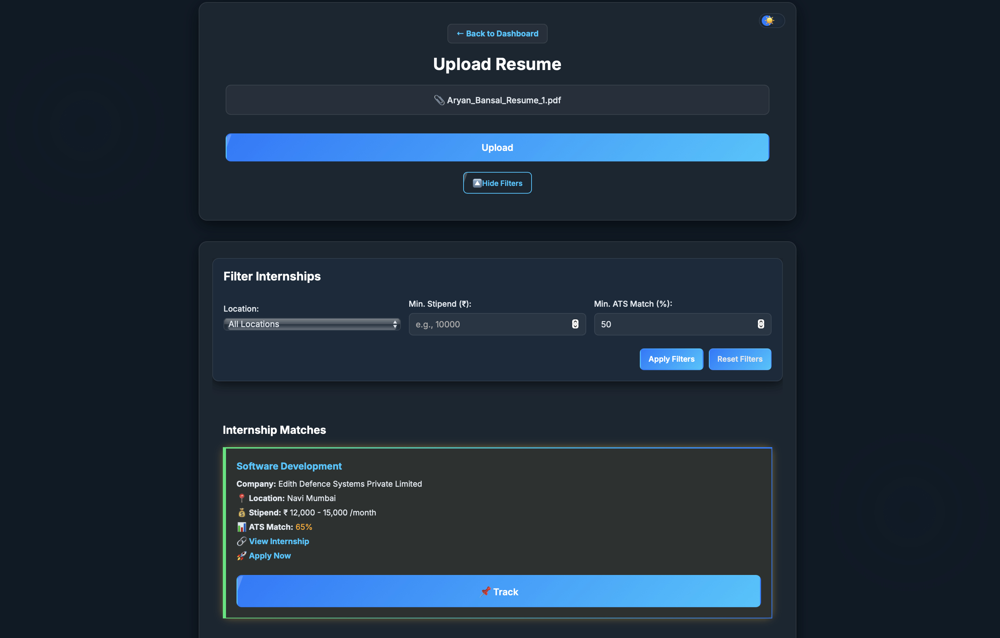
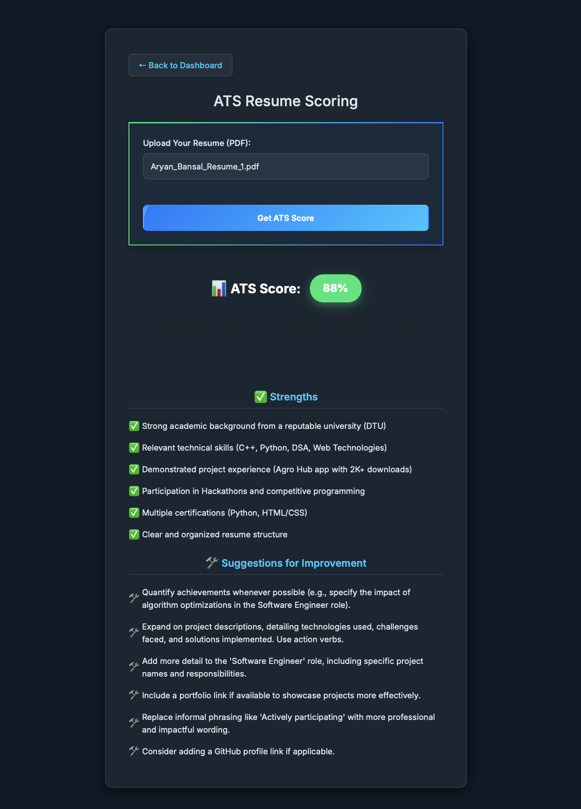
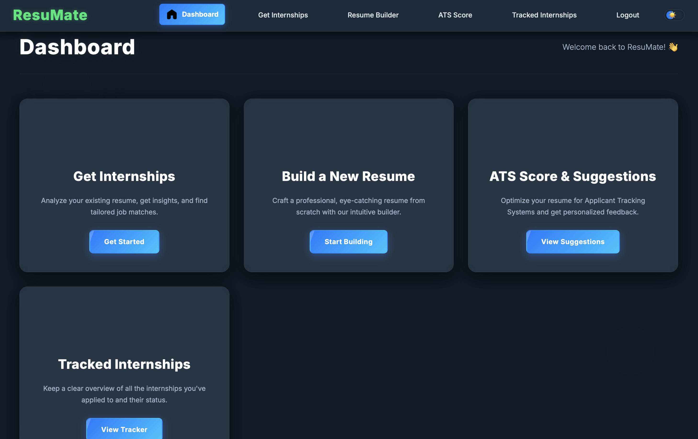

# 📄 ResuMate – Your AI-Powered Resume & Internship Assistant


**ResuMate** is a smart, AI-driven platform that helps students and freshers build strong resumes, get real-time ATS feedback, and find the most relevant internships from Internshala. It combines the power of NLP, web scraping, and large language models like Gemini to automate and enhance your career journey.

---

## 🚀 Features

- ✨ Gemini-powered **Resume Chatbot**
- 📄 **PDF Resume Upload** with skill extraction
- 🧠 **Real-time ATS Scoring & Suggestions**
- 🔎 **Internship Matcher** scraping Internshala
- 💸 **Stipend-based Sorting** of top 10 internships
- 🖥️ Clean and minimal **Frontend Dashboard**

---

## 📂 Project Structure

```
ResuMate/
├── backend/
│   ├── backend/
│   ├── config/
│   ├── github/
│   ├── models/
│   ├── nltk_data/
│   ├── node_modules/
│   ├── public/
│   ├── routes/
│   ├── templates/
│   ├── uploads/
│   ├── venv/
│   ├── .env
│   ├── ats_matcher.py
│   ├── debug_log.csv
│   ├── demo.py
│   ├── Details_csv/
│   ├── Details_csv.csv
│   ├── Dockerfile
│   ├── internshp_links_apply.txt
│   ├── internship_links.txt
│   ├── package-lock.json
│   ├── package.json
│   ├── requirements.txt
│   ├── Resume-7.pdf
│   ├── resume.py
│   ├── server.js
│   └── skill_extractor.py
├── fronten/
│   ├── ats.html
│   ├── ats.js
│   ├── dashboard.html
│   ├── index.html
│   ├── login.html
│   ├── login.js
│   ├── resume-builder.html
│   ├── script.js
│   ├── signup.html
│   ├── signup.js
│   ├── tracked.html
│   └── upload.html
```

---

## 🛠️ Setup Instructions

### ⚙️ Backend Setup

1. Navigate to backend folder:
   ```bash
   cd backend
   npm install
   ```

2. Create a `.env` file inside `backend/`:

   ```
   MONGO_URI=your_mongo_connection_string
   JWT_SECRET=your_secret_key
   ```

3. Start the backend server:
   ```bash
   node server.js
   ```

---

### 🐍 Python Script Setup

Make sure Python 3 is installed.

1. Install dependencies:

   ```bash
   pip install -r requirements.txt
   ```

2. Test `skill_extractor.py` independently if needed.

---

### 🌐 Frontend Setup

1. Navigate to `fronten/` folder:
   ```bash
   cd fronten
   ```

2. Open `index.html` in a browser OR use Live Server extension in VSCode.

---

## 📈 How It Works

1. User signs up and logs in
2. Uploads resume in PDF format
3. Backend sends it to Python script
4. `skill_extractor.py`:
   - Extracts skills from resume
   - Scrapes Internshala
   - Sorts top internships
   - Generates `.csv` and `.txt` files
5. Dashboard displays:
   - Internship links
   - ATS score
   - Resume analysis

---

## 🖼️ Screenshots

### 🤖 Chatbot Interaction


### 📄 Resume Generation Page


### 🔍 Internship Finder


### 📊 ATS Score Result


### 🖥️ Dashboard Overview


### 📈 Track Internships Applied


---

## 🧰 Tech Stack

| Domain            | Technologies                                                 |
|------------------|--------------------------------------------------------------|
| **AI/ML**         | Python                                                       |
| **NLP**           | SpaCy, NLTK, Hugging Face Transformers                       |
| **Web Development** | React.js, Tailwind CSS, Node.js & Express, RESTful APIs  |
| **Web Scraping**  | BeautifulSoup, Scrapy, Requests, Selenium                    |
| **Database**      | MongoDB (with Mongoose ORM)                                  |

---

## 🔐 API Keys & Quota Management

> *Coming Soon*: Quota management and Gemini API key rotation

---

## ✅ Sample Output

- `Details_csv.csv`: Tabular data of top 10 internships
- `internship_links.txt`: Direct links to apply
- ATS and suggestions displayed on dashboard

---

## 📬 Contributing

Pull requests and issues are welcome!

1. Fork the repo
2. Create a new branch
3. Submit a PR with description of changes

---

## 🧑‍💻 Developer Info

**Team Members**: Aryan Bansal, Aryan Gupta, Arnav Bansal, Sanyam Jain  
**Organization**: DTU CSE

---

## 📜 License

This project is licensed under the [MIT License](LICENSE).

---

## 🙏 Acknowledgements

- [Internshala](https://internshala.com) – Internship source
- [Google Gemini](https://ai.google.dev) – LLM APIs
- [Node.js](https://nodejs.org/), [Python](https://www.python.org/) – Backend
- DTU and open-source ❤️
